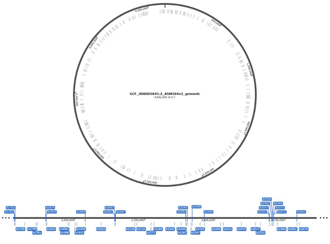

# TRE-scan说明书

## 主要功能：

经研究发现，基因编辑工具如ABEs（Adenine Base Editors，腺嘌呤基编辑器）、CBE（Cytosine Base Editors，胞嘧啶碱基编辑器）等除了会对目标DNA进行编辑，还会对细胞RNA进行一定程度的编辑。为了评估这类脱靶编辑的情况，需要进行一系列的处理如基因组比对、参考组建立、变异calling、突变筛选、覆盖度计算、下游分析、画图等，较为繁琐。因此，本公司开发了RNA编辑鉴定分析软件TRE-scan（Transcriptome-wide RNA Editing scan），基于gatk套件的Mutect2工具以及Snakemake工作流，本系统能够便捷、高效地鉴定实验组中发生的RNA编辑事件。

## 系统特点：

本软件以命令行的形式在linux操作系统上运行。

本系统基于Snakemake工作流，运行整个分析流程仅需提供对应的输入文件（RNA-seq测序文件、参考基因组及注释文件、样本信息文件）并配置相关参数即可，流程运行相关参数可在config文件中调整。

运行软件时，可以预先查看工作流程。若不想运行整个流程，可以指定希望生成的目标文件从而使软件仅运行能够创建该文件而需要运行的必要流程。

若想重新运行某一流程，软件会自动检测缺失的文件并运行相应的流程部分，已存在的运行结果不会重新生成。

## 安装和配置：

环境要求：

- conda
- snakemake
- samtools
- gatk
- STAR
- bam-readcount
- vcf-readcount-annotator
- bedtools
- dot

下载源码压缩包

解压后，将解压后的路径加入环境变量即可在任意位置运行脚本run_RNAedit

## 运行前准备：

运行前需要先进行如下的准备工作：

### 1.  整理样本信息

样本信息为一个csv文件，文件名为mapping.csv：


图 1 mapping.csv文件内容

其中列的解释如下：

- sample_id：样本名，不能包含\*[],;/等特殊字符，最好由数字、英文、下划线、连字符组成。此外，样本名不能有重复；
- file：样本对应的RNA-seq测序fastq文件的路径。若为双端测序样本，则R1和R2文件之间用一个英文分号”;”隔开；
- sample_type：若为测试组（需要进行RNA编辑情况分析），则填写“test”，其余不填即可；
- control_sample：样本对应的对照组样本。若有多个对照样本，则样本间用一个英文逗号“,”隔开，若没有对应的对照，则不填；
- use_as_pon：该样本是否用来组成pon（panel of normals，见下文）参考。若是，则填写“yes”，否则不填。

### 2.   配置运行参数

软件的参数配置文件为{RNAedit}/config.yaml，其中{RNAedit}表示软件的安装目录。有关yaml文件格式的介绍，参见https://docs.fileformat.com/programming/yaml/。

该配置文件的各项配置解释如下：

- mapping_file：mapping.csv文件路径。最好填写绝对路径，若为相对路径，则应填写对应软件执行目录的相对路径，下同。；
- reference：参考基因组fasta文件路径；
- annotation_gtf：参考基因组对应的基因组注释gtf文件；
- STARref：STAR基因组索引文件夹路径。若无，则不填即可，软件会自动检测填写的是否为有效的索引文件夹并在需要时创建该文件夹；
- genomeSAindexNbases：参考STAR官方文档https://physiology.med.cornell.edu/faculty/skrabanek/lab/angsd/lecture_notes/STARmanual.pdf，在参考基因组很小时，该参数也应相应减小，最佳数值为min(14, log2(GenomeLength)/2 - 1)。例如，人对应的该参数为14，大肠杆菌为10；
- outFilterMultimapNmax：参考STAR官方文档，在一个read比对到多个位置的情况下，比对位置数超过该参数的read将被视为无效的read。
- sjdbOverhang：参考STAR官方文档，该参数大小等于最长read长度-1；
- min_sample_count：当鉴定出的某一突变同样出现在pon中，若pon中存在该突变的样本数大于等于该参数时，该突变将被认为是非RNA编辑事件。需小于等于use_as_pon为“yes”的样本数；
- min_mapping_quality：在计算突变的覆盖度时，考虑的read需要至少满足该参数指定的比对质量，即低于该参数指定的比对质量的read不会用于突变覆盖度的计算；
- min_base_quality：同上，在计算突变的覆盖度时，考虑的read在该突变位点需要至少满足该参数指定的碱基质量；
- maximum_alt_percent_in_control：RNA编辑突变在对照中出现的最高频率。若突变在对照中出现的频率超过该数值，则该突变将被认为是非RNA编辑事件；
- minimum_editing_site_coverage_in_test：RNA编辑突变在测试组中的最小覆盖度。若突变的覆盖度低于该数值，则该突变将被认为是无效的；
- sequencelogo_span_len：在分析RNA编辑的序列偏好时，编辑位点两边考虑的的序列长度。若长度为5，则表示对编辑位点上、下游各5bp范围（一共11bp）进行分析；
- gtf2bed_field：在提取编辑位点的基因注释信息时，以该关键词（field）对gtf文件的信息进行提取。例如，人的基因组注释精确到外显子（exon）层面，因此可以提取外显子层面的注释信息；大肠杆菌的注释精确到基因/编码框层面，因此需要填写“gene”。

```yaml
mapping: "mapping.csv"
reference: "reference/GRCh38.p13.genome.fa"
intervals_list: "reference/human.intervals.list"
annotation_gtf: "reference/gencode.v42.chr_patch_hapl_scaff.annotation.gtf"
STAR:
 STARref: "/Yol_Data/resources/Gencode_human_ref/hg38_STAR_ref"
 genomeSAindexNbases: 14
 outFilterMultimapNmax: 20
 sjdbOverhang: 150 #read_length - 1
min_sample_count: 2
min_mapping_quality: 20
min_base_quality: 30
maximum_alt_percent_in_control: 0.01
minimum_editing_site_coverage_in_test: 10
sequencelogo_span_len: 5
gtf2bed_field: "exon"
```

## 运行软件：

流程的运行可以使用脚本runRNAedit：

runRNAedit -d {dir} -c {config_file} -t {target_file1,target_file2...} -m {cores} -p {plot_prefix} -n

参数的解释如下：

| 参数 | 解释                                                   | 默认值                                |
| ---- | ------------------------------------------------------ | ------------------------------------- |
| -d   | 运行的路径。所有的过程文件、结果文件都将在此路径下生成 | .（当前路径）                         |
| -c   | 使用的config文件                                       | {build_dir}/configs/config_human.yaml |
| -t   | 目标文件。若不指定，则默认运行整个流程                 | success（整个流程）                   |
| -m   | 使用核数                                               | 128                                   |
| -p   | 流程图文件的前缀。若指定，则不运行流程而是画出流程图   | 无                                    |
| -n   | 输出运行步骤而不运行流程                               | 无                                    |

表 1 软件参数

其中{cores}为运行使用的CPU核数。在不超过该核数的前提下，软件会自动调度任务并行执行以充分利用运算资源。主要步骤设置的默认核数如下：

| 步骤                 | 线程数 | 描述                                      |
| -------------------- | ------ | ----------------------------------------- |
| generate_STAR_ref    | 64     | 为STAR建立参考                            |
| STAR                 | 64     | 运行STAR比对                              |
| samtools_sort        | 64     | 比对结果排序                              |
| mark_dup             | 32     | 比对结果去重                              |
| samtools_index       | 32     | 比对结果建立index文件                     |
| pon_mutect2          | 64     | 对panel of normals样本进行Mutect2突变检测 |
| mutect2              | 64     | 对测试样本进行Mutect2突变检测             |
| mutect2_tumor_only   | 64     | 对无对照的测试样本进行Mutect2突变检测     |
| filter               | 1      | 筛选突变                                  |
| select_snp           | 1      | 筛选单碱基替换突变                        |
| bam_readcountm       | 64     | 计算突变位点覆盖度信息                    |
| readcount_annotate   | 1      | 对突变重注释                              |
| bedtool_intersect    | 1      | 提取突变位点基因注释信息                  |
| draw_all_test_sample | 1      | 分析结果，画图                            |

表 2 流程默认核数

如需调整任务的默认核数，可以在snakefile对应的rule-threads下调整。

在运行流程前，可以通过如下指令：

runRNAedit {参数} -n

查看将要运行的流程。其中-n指令将输出所有将要运行的流程命令到当前终端：

 

图 2 流程输出截图

其中列出了执行每一步的具体内容，包括指令、线程数、输入/输出、运行原因等。确认无误后，方可运行。

若不运行整个分析流程，而是运行部分从而获取流程的中间文件，可以运行如下指令：

runRNAedit {参数} -t {target}

通过指定希望生成的文件{target}从而运行必要的指令。若有多个target文件，可以用空格隔开。例如，查看生成pon.vcf参考文件的工作流程可以运行：

runRNAedit -t pon.vcf -p pon

对应的工作流程如下：

pon.dag.svg:

 

图 3 pon.dag.svg

pon.filegraph.svg:

 

图 4 pon.filegraph.svg

可见，软件为了生成目标文件pon.vcf，软件对mapping.csv文件中use_as_pon标记为“yes”的样本进行了处理，通过一系列操作最终得到pon.vcf参考文件。

在成功生成pon.cvf文件后，若希望继续运行后续的流程，可在不移动pon.vcf文件的情况下再次运行分析流程：

runRNAedit {参数} -t {new_target}

其中{new_target}为希望生成的其他目标文件。若不指定-t，则默认运行整个流程。

这里以大肠杆菌的某一批次实验为例，展示软件内置的全部流程（图1）：

工作流程：

 

图 5 RNA-edit总流程

文件工作流：

 

图 6 总流程文件示意图

整个工作流程由23个步骤组合而成，主要步骤的详细信息见表2。简单来讲，软件建立了pon参考，并对每一个测试组样本（mapping.csv中sample_type为“test”的样本）进行了突变的calling以及筛选，同时提取了突变位点的注释以及覆盖度信息。最后，每一个测试组样本会生成{test_sample}.res和{test_sample}.annotation文件，分别对应其碱基替换突变信息（测试组、对照组ref和alt覆盖度）以及这些替换位点的注释信息（正/负链信息、基因信息、转录本信息），这些文件通过最终的分析和画图脚本draw_all_test_samples.R处理从而得到一系列分析结果：曼哈顿图、序列标识图、突变统计直方图、散点图（图7）以及详细的突变信息列表。

 

图 7 RNA编辑分析结果

此外，生成的{sample}.RNA_edits.bed结果文件可用于查看鉴定出的RNA编辑位点在染色体/基因组上的分布情况。例如将文件用SnapGene打开：

 

图 8 编辑位点查看

可以直观查看每一个RNA编辑位点的相关信息。

## 设计原理：

鉴定RNA编辑事件本质上是鉴定测试组相对对照组在转录组替换变异上的显著差异。该鉴定过程类似肿瘤研究中的体细胞变异分析，因此可以使用gatk套件的Mutect2进行变异的相关分析。该软件通过概率模型考虑了变异属于胚系突变以及测序误差的情形，能够有效鉴定测试组相对对照组不同于以上情况的突变。

注：

1. 为了最大可能地排除测序误差造成的突变，需要建立pon（panel of normals）参考文件。该文件应由尽可能多的正常样本（对照组）创建，并在每一个测试组样本进行突变calling时排除同时存在于pon中的突变。例如，当min_sample_count=2时，只要突变在pon中的2个样本中出现，则为该突变加上“panel_of_normals”的注释。
2. 由于不同参考基因组的注释情况不同，如人类参考基因组注释到外显子层面，而大肠杆菌仅注释到基因层面，因此在获取突变位点的注释信息（正/负链、基因、转录本）时，需要指定gtf2bed_field参数用于提取对应层面的信息。该参数对应gtf文件的第三列。提取的注释信息包括以下域： “gene_id”、“gene_name”、“transcript_id”、“transcript_name”、“gene_type”、“transcript_type”、“strand”。
3. 软件默认提取A-G突变。因此，突变位点转录的strand信息尤为重要。考虑到注释可能存在的冗余（即一个位点对应多个注释），软件会将某一位点所有注释的链进行比较从而确定该位点转录的是正链或负链。例如，某突变在vcf文件中为T-C突变，其对应位置有3条注释为正链（“+”），1条为负链，则认为该突变位点为RNA上的T-C突变；若3条为负链，1条为正链，则认为该突变为RNA上的A-G突变。若注释的正负链数相等，则去掉该位点的的记录。
